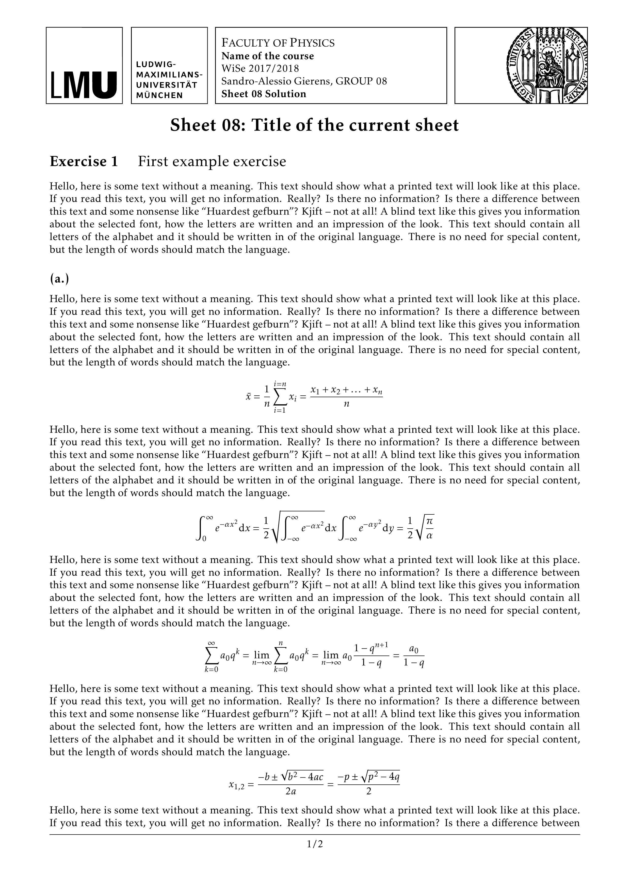

# LMU-homework

This is a LaTeX template for professional looking homework submissions at
LMU Munich.



## Usage
1. Have a look at the [sample.tex](sample.tex) and alter it to your needs
2. Build the [sample.pdf](sample.pdf) with
```bash
make
```

Note that you can clean up with:
```bash
make clean
```

## License
This code is distributed under [GPLv3](LICENSE) license.

Note that the [Ludwig Maximilians University](https://lmu.de) owns the 
[logo](img/logo) and [seal](img/seal), you need to confirm with their
copyright when using the images for more than just your homework.
